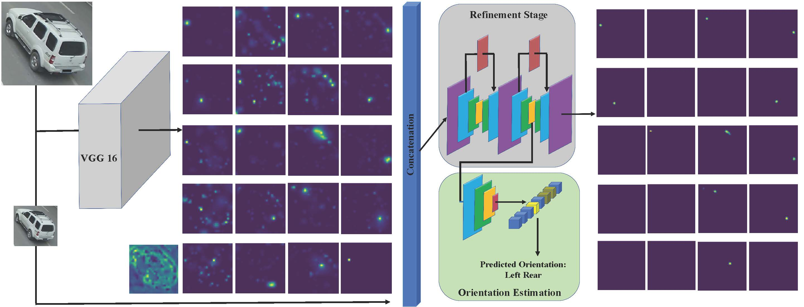

# Vehicle Key-Point & Orientation Estimation

The repository contains the code for vehicle key-point and Orientation estimation Network proposed in the [A Dual Path Model With Adaptive Attention For Vehicle Re-Identification](http://openaccess.thecvf.com/content_ICCV_2019/papers/Khorramshahi_A_Dual-Path_Model_With_Adaptive_Attention_for_Vehicle_Re-Identification_ICCV_2019_paper.pdf) which has been accepted as an **oral presentation** in ICCV 2019. The code for re-identification network does not exist in the repository.

The code for vehicle key-point and orientation estimation has been released to facilitate future research in vehicle alignment, 3d vehicle modeling and vehicle speed estimation.   

## Vehicle Key-Point & Orientation Estimation Pipeline

The figure below demonstrates the pipeline for prediction of 20 vehicle landmarks and classify vehicle's orientation into one of 8 classes all defined in [here](https://github.com/Zhongdao/VehicleReIDKeyPointData).



Key-point estimation is done in two stages; in stage 1 the model tries to come up with coarse estimation of key-points location and in stage 2 those coarse estimates are refined through an hourglass like structure and in a parallel branch the orientation of the vehicle is predicted as well.


## Getting Started
Clone this repository with the following command:

```
git clone https://github.com/Pirazh/Vehicle_Key_Point_Orientation_Estimation
```

## Requirements

The code is written in Python 2.7 with [Pytorch](https://pytorch.org) version "0.4.1". To install the dependencies run the following command:

```
pip install -r requirements.txt
```

Then you have to download and put the pre-trained model and [Veri-776](https://vehiclereid.github.io/VeRi/) dataset in the following directories:

- Put the `VeRi` folder containing the dataset into `./data/`. You can alternatively change the paths in the `./tools/paths.py` according to your preference. 

- Download the pre-trained stage1 & stage2 Key-point models from [here](https://drive.google.com/file/d/1A4A8Xu6RbVHUK6Pq5QSmKQt7jS_p5OKx/view?usp=sharing) and [here](https://drive.google.com/file/d/1jZR1YuDOLiZ3lh0B_CFJQp2aWh-qUU5C/view?usp=sharing) and put them in `./checkpoints/stage1/` and `./checkpoints/stage2/` directories.

## Testing 
To test an already trained model, you have to specify the test phase, stage1(Coarse key-points estimation)/stage2(Entire model for fine key-points generation and orientation estimation) use cases and the path to the trained model. This can be achieved by running the following command:

### Stage1

```
python main.py --phase test --use_case stage1 --resumed_ckpt PATH_TO_STAGE1_PRE_TRAINED_MODEL 
```

### Stage2 

```
python main.py --phase test --use_case stage2 --resumed_ckpt PATH_TO_STAGE2_PRE_TRAINED_MODEL
```

The number of workers, train/test batch size can be set through arguments `--num_workers`, `--train_batch_size`, `--test_batch_size`. The code also has multi GPU training/testing support which is enabled by passing `--mGPU` argument in the `main.py` script. If you wish to visualize the predicted key-points, you can do so by passing the `--visualize` argument.

## Training

### Stage1

To train stage1 of the model run the following command:

```
python main.py --phase train --use_case stage1 --mGPU --lr 0.0001 --epochs 15 
```

After training, results can be found in `./checkpoints/stage1/TIME_STAMP_STAMP_WHEN_TRAINING_STARTED`.

### Stage2

To train the entire model run the followning:

```
python main.py --phase train --use_case stage2 --mGPU --lr 0.0001 --epochs 15 --stage1_ckpt PATH_TO_THE_STAGE1_TRAINED_MODEL
```

Training results can be found in `./checkpoints/stage2/TIME_STAMP_WHEN_TRAINING_STARTED`.

## Results 

|       |  Stage1  |  Stage2  |
| ---------------------------------- | --- | ---------------------- |
|Key-Point localization MSE (pixels) | 1.95 | 1.56 |
| Orientation Classification Accuracy | - | 84.44% |

Note that the localization MSE is calculated in 56 * 56 heatmaps. The following figure is the confusion matrix for the vehicle orientation estimation. In most of the cases the network classifies the orientation correctly; however in some cases since there is no clear boundry between defined orientation classes *e.g.* left front and left, the network struggles the in determining the correct class.


## Cite 

If you find this repository useful in your research please cite our paper:

    @InProceedings{Khorramshahi_2019_ICCV,
        author = {Khorramshahi, Pirazh and Kumar, Amit and Peri, Neehar and Rambhatla, Sai Saketh and Chen, Jun-Cheng and Chellappa, Rama},
        title = {A Dual-Path Model With Adaptive Attention for Vehicle Re-Identification},
        booktitle = {The IEEE International Conference on Computer Vision (ICCV)},
        month = {October},
        year = {2019}
        }

## Questions

If you have any questions regarding the model and the repository send me an email at (pkhorram@terpmail.umd.edu).
